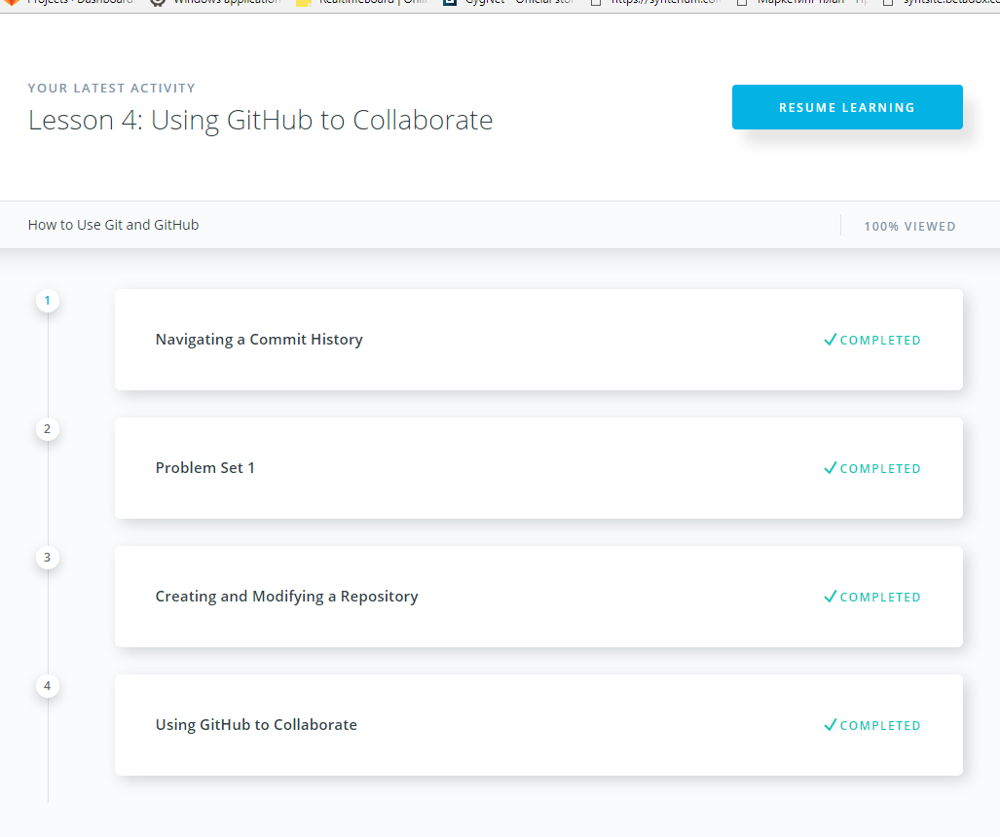
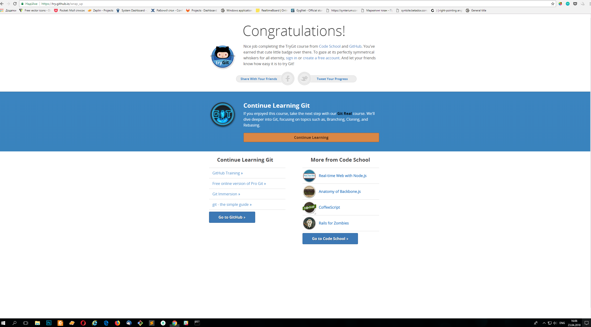
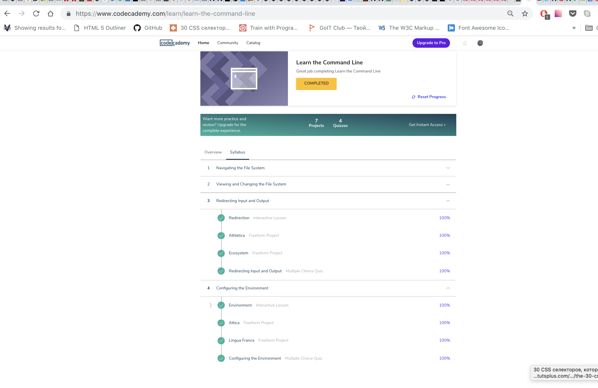
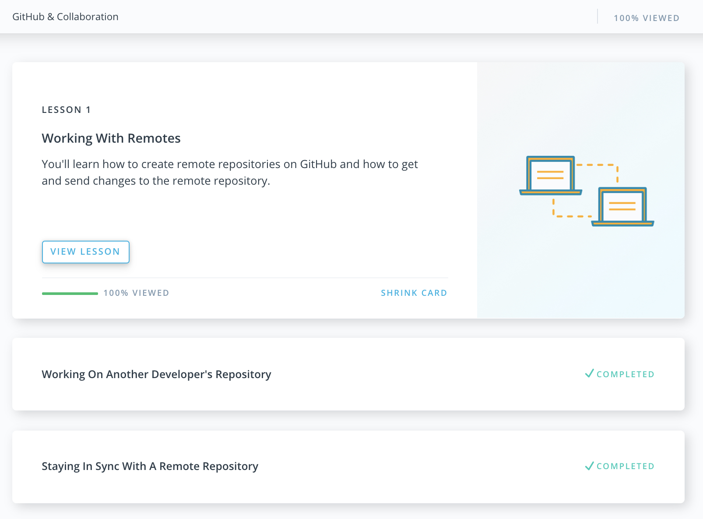
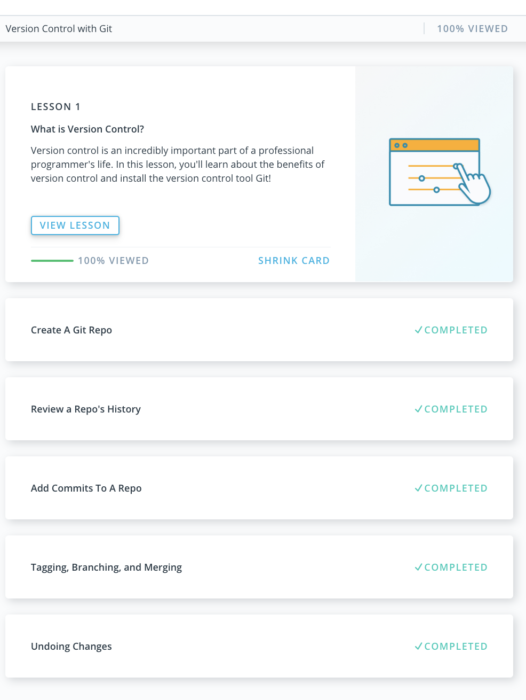

# kottans_frontend

- [x] [Git and GitHub](https://github.com/earthaddicted/kottans_frontend/blob/master/README.md#heavy_check_mark-git-and-github)
- [x] [Linux CLI, and HTTP](https://github.com/earthaddicted/kottans_frontend/blob/master/README.md#heavy_check_mark-linux-cli-and-http)
- [x] [Git Collaboration](https://github.com/earthaddicted/kottans_frontend/blob/master/README.md#heavy_check_mark-git-collaboration)

## :heavy_check_mark: Git and GitHub

- Thanks to this course I learnt to make a pull request from other's repo

- The existance of Git errors surprised me pretty much

- I discovered how to compare files in console (before I compared them on github) and for sure I will use this and many useful  things that I have learnt from udacity lessons

:paperclip: 

:paperclip: 

## :heavy_check_mark: Linux CLI, and HTTP

:paperclip: 
- 	Parts about redirecting inputs and outputs, configuring environment were new to me (before I worked only several times with nano files).
-	I was surprised how many things can be done with the help of a command line.
-	I'm glad that I had a chance to find out about such useful commands and for sure I will be more confident to work with nano and command line in general.

## :heavy_check_mark: Git Collaboration

:paperclip: 
:paperclip: 

- It was useful to refresh memories about git push/pull/merge commands and to practice forking of other repo
- Before I never gave a thought that git pull is really the same as a combination of git fetch and git merge
- For sure I will try to use what I've learned in these courses
