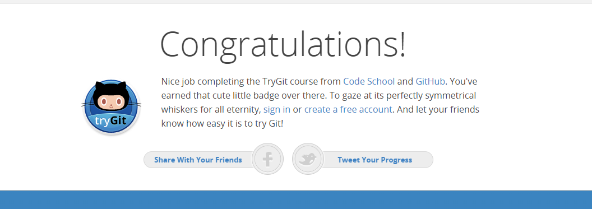

# kottans_frontend

---

#### :heavy_check_mark: Task 0 (get familiar with Git and GitHub)

- Thanks to this course I learnt to make a pull request from other's repo

- The existance of Git errors surprised me pretty much

- I discovered how to compare files in console (before I compared them on github) and for sure I will use this and many useful  things that I have learnt from udacity lessons

:paperclip: 

:paperclip: 

---

