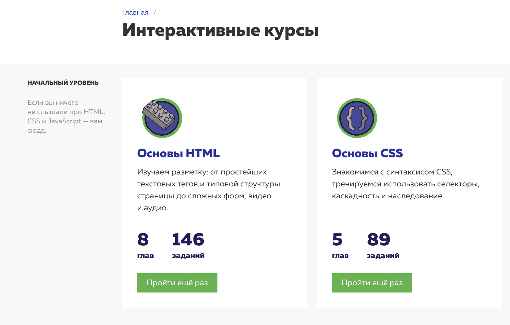

# kottans_frontend

- [x] [Git and GitHub](https://github.com/earthaddicted/kottans_frontend/blob/master/README.md#heavy_check_mark-git-and-github)
- [x] [Linux CLI, and HTTP](https://github.com/earthaddicted/kottans_frontend/blob/master/README.md#heavy_check_mark-linux-cli-and-http)
- [x] [Git Collaboration](https://github.com/earthaddicted/kottans_frontend/blob/master/README.md#heavy_check_mark-git-collaboration)

- [x] [Intro to HTML and CSS](https://github.com/earthaddicted/kottans_frontend#heavy_check_mark-intro-to-html-and-css)
- [x] [Responsive Web Design](https://github.com/earthaddicted/kottans_frontend#heavy_check_mark-responsive-web-design)
- [x] [JS Basics]()

## :heavy_check_mark: Git and GitHub

- Thanks to this course I learnt to make a pull request from other's repo

- The existance of Git errors surprised me pretty much

- I discovered how to compare files in console (before I compared them on github) and for sure I will use this and many useful  things that I have learnt from udacity lessons

:paperclip: 

:paperclip: 

## :heavy_check_mark: Linux CLI, and HTTP

:paperclip: 
- 	Parts about redirecting inputs and outputs, configuring environment were new to me (before I worked only several times with nano files).
-	I was surprised how many things can be done with the help of a command line.
-	I'm glad that I had a chance to find out about such useful commands and for sure I will be more confident to work with nano and command line in general.

## :heavy_check_mark: Git Collaboration

:paperclip: 
:paperclip: 

- It was useful to refresh memories about git push/pull/merge commands and to practice forking of other repo
- Before I never gave a thought that git pull is really the same as a combination of git fetch and git merge
- For sure I will try to use what I've learned in these courses

## :heavy_check_mark: Intro to HTML and CSS

:paperclip: 
:paperclip: 

- it was good to practice all these basic html/css rules
-
- I gladly repeat basics because in daily life when you have monotonous tasks sometimes such basics just sleep out of your mind that's why I think it is necessery to repeat them

## :heavy_check_mark: Responsive Web Design

:paperclip: 
:paperclip: 

- it was good to learn deeper about responsive design, I learned it all by practice before and it was good to compare and check all what I knew already and what udemy teaches and learn it from another angle,
also I found out another way to make responsible table

- Before I used metatag for viewport but never really gave a thought about dip (device independent pixels) and how can they differ from hardware pixels and how much this metatag makes life easier

## :heavy_check_mark: JS Basics
- I read a lot of JS basics (books, materials on websites), but without a continuous practice can say that it is mostly useless thing because you forget it in a while, it is really cool to do practice tasks, for example, conditions in Udacity, I had big fun solving quizes :)
